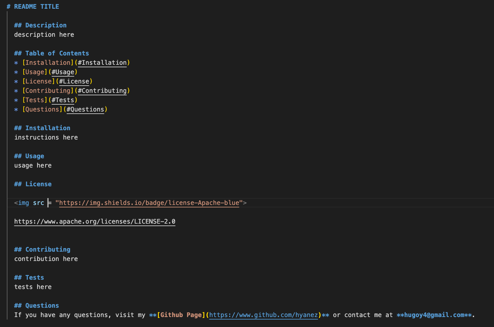

# README-GENERATOR

## Description

Program that produces generates a profession README dynamically using Javascript and Node.js, package.json, while also using dependencies packages such as "fs" and "inquirer".

## User Story

```md
AS A developer
I WANT a README generator
SO THAT I can quickly create a professional README for a new project
```

## Mock-Up

The following image shows a mock-up of the generated README’s appearance and functionality:




## Links

- [Deployed Link](https://hyanez.github.io/README-GENERATOR/)
- [Github Link](https://github.com/hyanez/README-GENERATOR)
